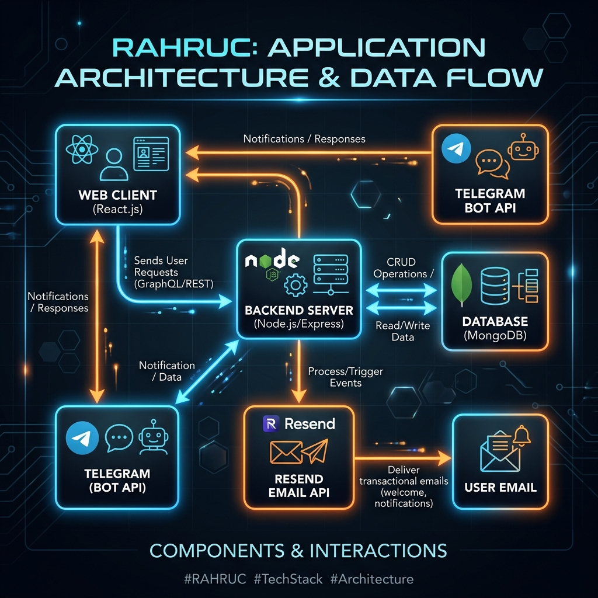
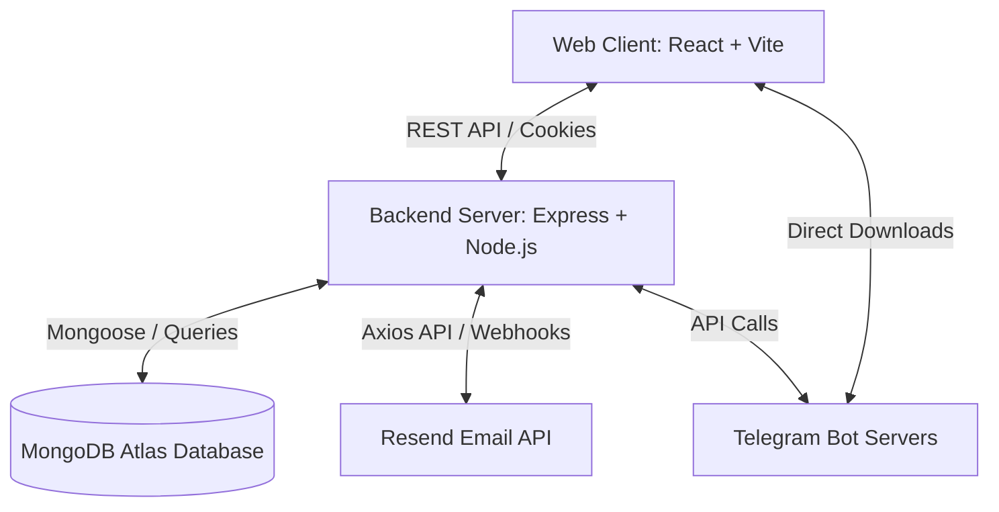

# 🛡️ RAHRUC (PrivateSafe) — Telegram-Backed Cloud Storage

RAHRUC (PrivateSafe) is a secure, high-performance, and unlimited cloud storage application that leverages the **Telegram Bot API** as its underlying storage engine. It offers a modern, fully-featured Google Drive-like web interface to organize, view, and share files, all while storing the data securely on Telegram servers.

---

## 🚀 Key Features

*   📁 **Full File Management:** Create folders, upload files, rename, move, copy, and delete items.
*   🔒 **Secure Vault:** A password-protected secure space for highly sensitive files.
*   📧 **OTP Authentication:** Secure signup and login flow protected by Resend email verification codes.
*   🤖 **Telegram Integration:**
    *   Direct uploads from web interface to Telegram servers.
    *   **Telegram Inbox:** Forward files directly to your bot on Telegram, and they automatically sync and catalog inside the web app.
    *   Pairing system with a simple OTP/Token link.
*   📸 **Rich Media Previews:** Built-in photo viewer, video player, and document reader.
*   ⭐ **Starred Files & Trash:** Pin important files and manage recently deleted items.
*   ⚙️ **Custom Bot Configuration:** Use the default shared bot or hook up your own Custom Telegram Bot Token & Chat ID for private storage ownership.

---

## 🏗️ Architecture & Flow





---

## 🛠️ Tech Stack

### Frontend (Client)
*   **React** (with Vite builder)
*   **TailwindCSS** for styling
*   **Axios** for API communication
*   **Framer Motion** for animations
*   **Zustand** for global state management

### Backend
*   **Node.js** & **Express**
*   **MongoDB** & **Mongoose** (ODM)
*   **node-telegram-bot-api** for Telegram bot control
*   **Zod** for environment & request validation
*   **Resend API** for sending secure authentication OTPs

---

## ⚙️ Project Setup & Installation

Follow these steps to run the project locally on your machine.

### Prerequisites
*   Node.js (v16+)
*   MongoDB Instance (or MongoDB Atlas URI)
*   Resend Account (with API Key)
*   Telegram Bot (created via [@BotFather](https://t.me/BotFather))

---

### 1. Backend Setup

1. Navigate to the backend directory:
   ```bash
   cd backend
   ```
2. Install dependencies:
   ```bash
   npm install
   ```
3. Create a `.env` file in the `backend` folder and add the following configuration:
   ```env
   PORT=5000
   NODE_ENV=development
   
   # MongoDB connection URL
   MONGO_URI=mongodb+srv://<username>:<password>@cluster.mongodb.net/rahruc
   
   # JWT Configuration
   JWT_ACCESS_SECRET=your_super_secret_access_key_12345
   JWT_REFRESH_SECRET=your_super_secret_refresh_key_54321
   
   # Frontend URL
   CLIENT_URL=http://localhost:5173
   
   # Resend Email Configuration
   RESEND_API_KEY=re_your_resend_api_key
   RESEND_FROM_EMAIL=RAHRUC <noreply@yourdomain.online>
   
   # Telegram Configurations (Optional - for custom global bot)
   TELEGRAM_BOT_TOKEN=your_global_bot_token
   TELEGRAM_CHAT_ID=your_global_chat_id
   ```
4. Start the backend server:
   * **Development Mode (Auto-restart):**
     ```bash
     npm run dev
     ```
   * **Production Mode:**
     ```bash
     npm start
     ```

---

### 2. Frontend (Client) Setup

1. Navigate to the client directory:
   ```bash
   cd ../client
   ```
2. Install dependencies:
   ```bash
   npm install
   ```
3. Create a `.env` file in the `client` folder:
   ```env
   VITE_API_URL=http://localhost:5000/api/v1
   ```
4. Start the client dev server:
   ```bash
   npm run dev
   ```
5. Open your browser and navigate to `http://localhost:5173`.

---

## 💡 Important Configuration Notes

### 1. Email OTP Sending (Resend)
*   If your Resend account is in **Sandbox** mode, you can only send emails to your own registered account email.
*   To send emails to any Gmail entered by users, you must verify your custom domain (e.g., `rahruc.online`) in the [Resend Dashboard](https://resend.com/domains) and update `RESEND_FROM_EMAIL` in the `.env` file accordingly.
*   **Development Fallback:** The backend has a fallback that logs the OTP code directly to the server terminal if Resend fails due to sandbox restrictions, so you can easily copy and paste the OTP for local testing.

### 2. Telegram Storage Hook
*   Users can link their Telegram accounts by generating a **Pairing Token** in their Web settings page.
*   Once paired, they can send files directly to the Telegram Bot, and the files will immediately appear in their **Telegram Inbox** folder in the web app!
